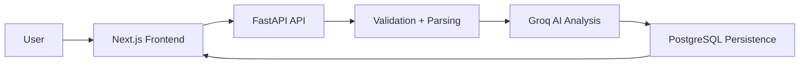
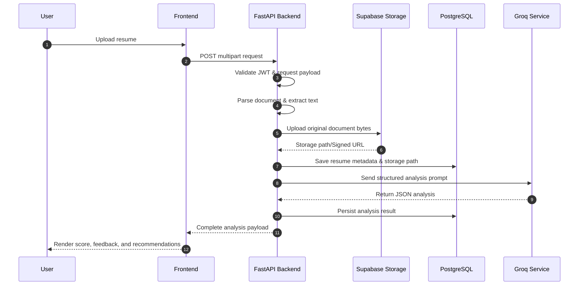
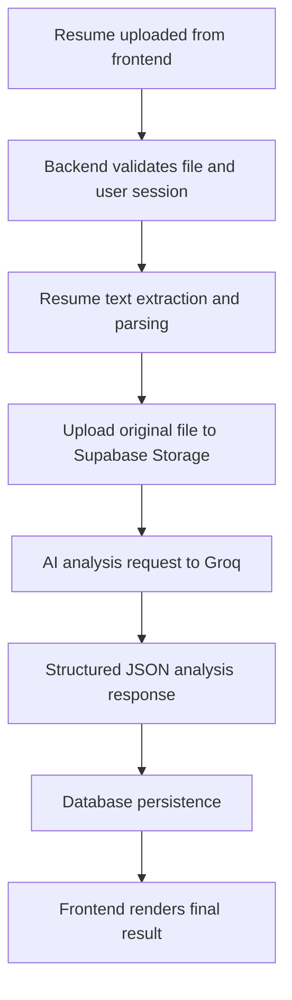

# InterviewAI

<div align="center">

## AI-Powered Resume Analysis & Mock Interview Platform

Analyze resumes with AI, identify skill gaps, generate actionable feedback, and prepare for interviews with a production-grade full-stack SaaS workflow.

[](https://nextjs.org/)
[](https://fastapi.tiangolo.com/)
[](https://supabase.com/)
[](https://www.postgresql.org/)
[](https://www.typescriptlang.org/)
[](https://www.python.org/)
[](https://opensource.org/license/mit)

</div>

---

## Live Demo

| Surface | Badge | Link |
|---|---|---|
| Frontend | [](https://ai-interview-platform-six-rho.vercel.app/) | [Open app](https://ai-interview-platform-six-rho.vercel.app/) |
| Backend API | [](https://ai-interview-platform-ef43.onrender.com/) | [Open API](https://ai-interview-platform-ef43.onrender.com/) |
| Swagger Docs | [](https://ai-interview-platform-ef43.onrender.com/docs) | [Open docs](https://ai-interview-platform-ef43.onrender.com/docs) |

---

## Features

### Authentication

| Capability | What it does | Why it matters |
|---|---|---|
| Supabase Auth | Handles secure sign in and sign out flows | Keeps authentication managed by a trusted auth provider |
| JWT-protected API routes | Verifies user identity before sensitive backend access | Prevents unauthorized access to private resources |
| Persistent sessions | Maintains logged-in state across visits | Improves user experience and retention |
| Middleware-protected routes | Guards dashboard and app pages at the frontend layer | Reduces accidental exposure of private screens |

### Resume Analysis

| Capability | What it does | Why it matters |
|---|---|---|
| Supabase Storage-backed uploads | Stores original resume files in private Supabase Storage | Keeps files retrievable without exposing them to the frontend |
| PDF and DOCX uploads | Accepts common resume formats | Supports real-world applicant workflows |
| AI resume evaluation | Reviews resume content with Groq-powered analysis | Produces structured, actionable feedback |
| ATS-style scoring | Assigns a score based on resume quality signals | Helps users understand readiness at a glance |
| Skill gap detection | Identifies missing or weak skills | Highlights what to learn next |
| Strength and weakness analysis | Summarizes what is working and what needs improvement | Makes feedback easier to act on |
| Role recommendations | Suggests roles aligned with the resume profile | Helps users target the right jobs |
| Improvement suggestions | Returns practical resume recommendations | Converts analysis into next steps |

### Mock Interview

| Capability | What it does | Why it matters |
|---|---|---|
| Resume-linked interview generation | Builds interview questions from a selected analyzed resume | Keeps interview practice aligned with profile and target role |
| Role and difficulty controls | Lets users choose role context and difficulty level | Supports beginner-to-advanced preparation paths |
| Session-based interview flow | Presents structured question-by-question interview sessions | Creates a realistic and repeatable practice loop |
| AI interview feedback | Evaluates responses and provides targeted guidance | Helps users improve answer quality over time |

### Dashboard & History

| Capability | What it does | Why it matters |
|---|---|---|
| Resume and interview history | Stores and surfaces past analyses and sessions | Enables progress tracking and repeat practice |
| Original resume download | Opens stored resume files through signed Supabase URLs | Lets users review the exact file they uploaded |
| Safe resume deletion | Removes the storage object before deleting the database row | Prevents orphaned files and stale records |
| Score trend visualization | Shows score progression over time | Makes improvement patterns visible |
| Recommended roles and skill gaps | Aggregates role suggestions and missing skills | Keeps learning priorities clear |
| Analytics summary cards | Highlights key metrics in one view | Improves decision-making speed for users |

### Job Match Analyzer

| Capability | What it does | Why it matters |
|---|---|---|
| ATS Match & Evaluation | Scores resume against a target job description (300-10,000 chars) | Identifies real-world ATS compatibility and role fit |
| Keyword & Skill Gap Analysis | Extracts missing keywords and skills | Helps candidates optimize their resume content for specific roles |
| Storage-backed Job Descriptions | Stores full job descriptions in Supabase Storage | Keeps original context retrievable for future prep or reporting |
| Premium PDF Reports | Generates polished PDF summaries utilizing ReportLab | Provides a shareable, offline-accessible analysis summary |
| Interview Integration | Pre-populates mock interview sessions based on job match details | Targets exact gap areas and topics identified during the match |

### Infrastructure

| Capability | What it does | Why it matters |
|---|---|---|
| PostgreSQL-backed persistence | Stores resume analysis history and metadata | Enables repeat usage and auditability |
| Supabase Storage integration | Stores uploaded resumes outside the database | Keeps large files and metadata separated cleanly |
| SQLAlchemy Async | Uses async ORM/database access patterns | Fits modern FastAPI production architecture |
| Alembic migrations | Manages schema evolution | Keeps database changes controlled |
| Vercel deployment | Hosts the frontend | Enables fast global delivery |
| Render deployment | Hosts the backend API | Provides simple production hosting |

### AI Features

| Capability | What it does | Why it matters |
|---|---|---|
| Groq-powered LLM analysis | Uses Groq for fast AI inference with configurable model settings | Keeps the product responsive |
| Structured JSON responses | Returns predictable analysis payloads | Makes frontend rendering and API integration reliable |
| Async AI processing pipeline | Runs analysis in a non-blocking backend flow | Improves scalability and responsiveness |
| Production-ready fallback handling | Handles failures more safely | Keeps the product usable under degraded conditions |

### UX Features

| Capability | What it does | Why it matters |
|---|---|---|
| Modern App Router UI | Uses Next.js App Router patterns | Keeps the frontend scalable and maintainable |
| Responsive dashboard interface | Adapts across desktop and mobile | Improves usability and polish |
| Drag-and-drop uploads | Streamlines resume submission | Lowers friction in the primary workflow |
| Toast notifications | Surfaces state changes and results | Makes feedback visible and immediate |
| Protected dashboard experience | Keeps the app feel cohesive after login | Supports a production SaaS experience |
| Multi-step interview setup flow | Guides users from resume selection to interview launch | Reduces setup errors and ambiguity |

---

## Motivation

InterviewAI exists to remove the gap between uploading a resume and actually knowing how to improve it.

Most applicants need more than a static score. They need structured feedback, skill-gap awareness, and a guided path from resume submission to interview readiness. This project turns that workflow into a focused product experience: upload a resume, analyze it with AI, store the result, and use the feedback to prepare for interviews with more confidence.

The goal is not just to generate output. The goal is to create a realistic, production-style SaaS product that feels useful to recruiters, internship reviewers, and technical hiring managers evaluating engineering judgment.

---

## Architecture

### System Flow



### Request Lifecycle



### Request Flow Overview



---

## Tech Stack

| Layer | Technologies |
|---|---|
| Frontend | Next.js 16, TypeScript, Tailwind CSS |
| Backend | FastAPI, SQLAlchemy Async, Alembic, Pydantic v2, AsyncPG, ReportLab |
| Database | PostgreSQL |
| Authentication | Supabase Auth |
| Storage | Supabase Storage (Resumes & Job Descriptions) |
| AI | Groq API, Llama models |
| Hosting | Vercel, Render |

---

## Project Structure

```text
resume-analyser/
│
├── frontend/
│   ├── app/
│   ├── components/
│   ├── services/
│   ├── hooks/
│   └── lib/
│
├── backend/
│   ├── app/
│   │   ├── api/
│   │   ├── core/
│   │   ├── db/
│   │   ├── schemas/
│   │   ├── services/
│   │   └── utils/
│   │
│   ├── alembic/
│   ├── requirements.txt
│   └── runtime.txt
│
└── README.md
```

---

## Resume Upload Flow

The backend upload pipeline is designed as a clear, production-style sequence:

1. The user uploads a resume from the frontend.
2. The backend validates the request, checks authentication, and verifies file input.
3. The resume is parsed and text is extracted for analysis.
4. The original file is uploaded to private Supabase Storage.
5. The extracted content is sent to the AI service with a structured prompt when analysis is requested.
6. The AI response is normalized into a stable JSON format.
7. The result is persisted in PostgreSQL with resume metadata and the storage path.
8. The frontend receives the analysis and renders the score, feedback, and recommendations.
9. Historical results remain available for later review and download.

This flow keeps the system modular and easier to debug while preserving a reliable user experience.

---

## Security

| Control | Implementation |
|---|---|
| JWT verification | Supabase JWT verification using JWKS |
| Supabase auth | Authenticated user sessions through Supabase Auth |
| Private file storage | Resume files are kept in Supabase Storage and exposed through signed URLs only |
| Protected APIs | Backend routes are guarded before sensitive actions |
| CORS handling | Cross-origin access is explicitly configured |
| Environment validation | Required runtime values are validated before use |

---

## Engineering Challenges Solved

| Challenge | Resolution |
|---|---|
| Next.js SSR issues | Structured frontend and auth handling to keep server and client behavior aligned |
| JWT verification with JWKS | Used Supabase-backed token verification for secure API access |
| Async SQLAlchemy | Built the backend around async database access patterns |
| Deployment debugging | Tuned Render and Vercel deployment settings for production behavior |
| CORS configuration | Explicitly configured cross-origin requests between frontend and backend |
| Render + Vercel production deployment | Separated frontend and API hosting for clean production rollout |
| Environment management | Kept secrets and runtime values isolated through environment variables |

---

## Local Development Setup

### 1️⃣ Clone Repository

```bash
git clone https://github.com/Chaitanya7777777/ai-interview-platform.git
cd ai-interview-platform
```

### 2️⃣ Backend Setup

Create virtual environment:

```bash
cd backend
python -m venv .venv
```

Activate venv:

Windows:

```bash
.venv\Scripts\activate
```

Linux / Mac:

```bash
source .venv/bin/activate
```

Install dependencies:

```bash
pip install -r requirements.txt
```

Create `.env`:

```env
DATABASE_URL=YOUR_DATABASE_URL

SUPABASE_URL=YOUR_SUPABASE_URL
SUPABASE_ANON_KEY=YOUR_SUPABASE_ANON_KEY
SUPABASE_SERVICE_ROLE_KEY=YOUR_SUPABASE_SERVICE_ROLE_KEY
SUPABASE_JWT_SECRET=YOUR_SUPABASE_JWT_SECRET
SUPABASE_JWT_AUDIENCE=authenticated
SUPABASE_JWT_ISSUER=YOUR_SUPABASE_ISSUER_OPTIONAL
SUPABASE_STORAGE_BUCKET=resumes

AI_PROVIDER=groq
GROQ_API_KEY=YOUR_GROQ_API_KEY
GROQ_MODEL=llama-3.3-70b-versatile

CORS_ORIGINS=http://localhost:3000
ENVIRONMENT=development
```

Run migrations:

```bash
alembic upgrade head
```

Start backend:

```bash
uvicorn app.main:app --reload
```

Backend runs on:

```text
http://localhost:8000
```

Swagger Docs:

```text
http://localhost:8000/docs
```

### 3️⃣ Frontend Setup

```bash
cd frontend
npm install
```

Create `.env.local`:

```env
NEXT_PUBLIC_API_URL=http://localhost:8000

NEXT_PUBLIC_SUPABASE_URL=YOUR_SUPABASE_URL
NEXT_PUBLIC_SUPABASE_ANON_KEY=YOUR_SUPABASE_ANON_KEY
```

Start frontend:

```bash
npm run dev
```

Frontend runs on:

```text
http://localhost:3000
```

---

## Deployment

### Frontend on Vercel

Deploy settings:

| Setting | Value |
|---|---|
| Root Directory | `frontend` |
| Platform | Vercel |

Environment Variables:

```env
NEXT_PUBLIC_API_URL=YOUR_RENDER_BACKEND_URL

NEXT_PUBLIC_SUPABASE_URL=YOUR_SUPABASE_URL
NEXT_PUBLIC_SUPABASE_ANON_KEY=YOUR_SUPABASE_ANON_KEY
```

### Backend on Render

Deploy settings:

| Setting | Value |
|---|---|
| Root Directory | `backend` |
| Platform | Render |

Build Command:

```bash
pip install -r requirements.txt
```

Start Command:

```bash
uvicorn app.main:app --host 0.0.0.0 --port 10000
```

Render Environment Variables:

```env
DATABASE_URL=YOUR_SUPABASE_POOLER_URL

SUPABASE_URL=YOUR_SUPABASE_URL
SUPABASE_ANON_KEY=YOUR_SUPABASE_ANON_KEY
SUPABASE_SERVICE_ROLE_KEY=YOUR_SUPABASE_SERVICE_ROLE_KEY
SUPABASE_JWT_SECRET=YOUR_SUPABASE_JWT_SECRET
SUPABASE_JWT_AUDIENCE=authenticated
SUPABASE_JWT_ISSUER=YOUR_SUPABASE_ISSUER_OPTIONAL
SUPABASE_STORAGE_BUCKET=resumes

AI_PROVIDER=groq
GROQ_API_KEY=YOUR_GROQ_API_KEY
GROQ_MODEL=llama-3.3-70b-versatile

CORS_ORIGINS=https://YOUR_VERCEL_DOMAIN.vercel.app
ENVIRONMENT=production
```

### Supabase

| Setting | Notes |
|---|---|
| Auth | Used for secure user authentication |
| Database | Backing store for application data |
| Storage | Private resume file storage and signed downloads |
| JWT secret | Required for token verification on the backend |

---

## API Examples

### Resume Upload

```http
POST /api/v1/resume/upload?analyse=true
Content-Type: multipart/form-data
```

Request:

```text
file=<resume.pdf>
```

Example response:

```json
{
  "resume_id": "8a0d2c8c-7cf4-4b46-99f0-7b1b77f5e2c1",
  "filename": "resume.pdf",
  "content_type": "application/pdf",
  "file_size_bytes": 123456,
  "text_length": 4821,
  "extracted_text": "...",
  "analysis_result": {
    "overall_score": 82,
    "strengths": [],
    "weaknesses": [],
    "missing_skills": [],
    "recommended_roles": [],
    "improvement_suggestions": []
  },
  "analysis_warning": null
}
```

### Resume History

```http
GET /api/v1/resume/history?page=1&page_size=10
```

Returns the authenticated user's paginated resume history, including the storage path for uploaded files and any saved analysis result.

### Resume Download

```http
GET /api/v1/resume/{resume_id}/download
```

This endpoint verifies ownership and redirects to a short-lived signed Supabase Storage URL.

### Resume Delete

```http
DELETE /api/v1/resume/{resume_id}
```

The backend deletes the storage object first and only removes the database row after storage deletion succeeds.

### Authenticated Request Pattern

```http
Authorization: Bearer <supabase_jwt>
```

Use this header for protected backend routes that require a verified user session.

### Response Shape

```json
{
  "overall_score": 82,
  "strengths": ["..."],
  "weaknesses": ["..."],
  "missing_skills": ["..."],
  "recommended_roles": ["..."],
  "improvement_suggestions": ["..."]
}
```

### Job Match API

#### Create Job Match

```http
POST /api/v1/job-match
Content-Type: application/json
Authorization: Bearer <supabase_jwt>
```

Request:
```json
{
  "resume_id": "8a0d2c8c-7cf4-4b46-99f0-7b1b77f5e2c1",
  "job_description": "We are looking for a Software Engineer with experience in FastAPI, Next.js, and PostgreSQL..."
}
```

Response:
```json
{
  "id": "2b0a3c9d-8cf4-4b46-99f0-7b1b77f5e2c2",
  "resume_id": "8a0d2c8c-7cf4-4b46-99f0-7b1b77f5e2c1",
  "resume_filename": "resume.pdf",
  "match_score": 85,
  "ats_score": 80,
  "strengths": ["Strong backend fundamentals", "Good SQL schema understanding"],
  "missing_keywords": ["JWKS", "Alembic migrations"],
  "missing_skills": ["OAuth2", "Docker"],
  "recommendations": ["Highlight your async database operations and migrations"],
  "role_fit": "Strong match for mid-level backend engineer",
  "interview_readiness": "Ready to practice core backend and database questions",
  "summary": "The candidate has most core skills, but lacks containerization experience...",
  "job_title": "Software Engineer",
  "company_name": "Tech Corp",
  "job_description_preview": "We are looking for a Software Engineer...",
  "has_stored_jd": true,
  "created_at": "2026-06-22T15:51:55Z"
}
```

#### Download Job Match PDF Report

```http
GET /api/v1/job-match/{job_match_id}/report
Authorization: Bearer <supabase_jwt>
```

Returns the generated PDF report stream.

#### Get Job Match History

```http
GET /api/v1/job-match/history?page=1&page_size=10
Authorization: Bearer <supabase_jwt>
```

Returns paginated job match evaluations for the logged-in user.

---

## Roadmap

- [x] AI Mock Interviews
- [ ] Real-time voice interviews
- [ ] AI answer evaluation
- [x] Resume ATS optimization & Job Matcher
- [x] Downloadable PDF Match Reports
- [ ] Resume templates
- [ ] AI-generated cover letters
- [x] User analytics dashboard
- [ ] Subscription system
- [ ] Team/company mode

---

## Future Improvements

- Voice-based interview practice with real-time feedback
- Retrieval-augmented generation for personalized question sets
- Vector search over resumes and interview history
- A more adaptive AI interviewer that changes difficulty dynamically
- Company-specific interview prep workflows based on role and domain

---

## Author

**Chaitanya Gulechha**

- [GitHub](https://github.com/Chaitanya7777777)
- [LinkedIn](https://www.linkedin.com/in/chaitanya-gulechha-328a89322/)

---

## Contributing

Contributions are welcome.

For larger changes, please:

1. Fork the repository.
2. Create a feature branch.
3. Make your changes.
4. Open a pull request with a clear description of the improvement.

Please keep contributions aligned with the existing architecture, product direction, and production-ready standards.

---

## Star the Project

If you find InterviewAI useful or impressive, please consider starring the repository and sharing feedback. Contributions, issues, and ideas are always welcome.
